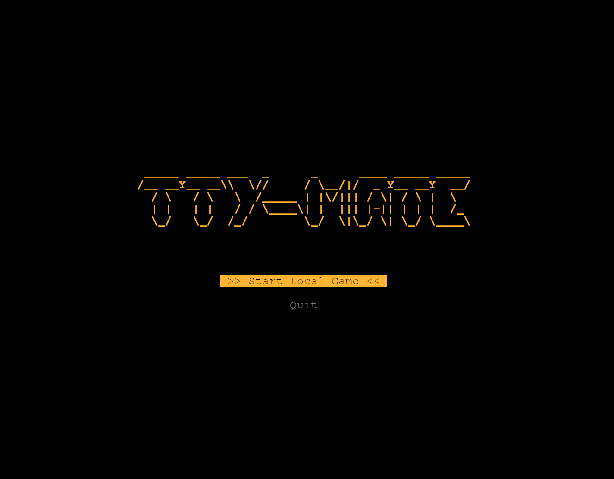
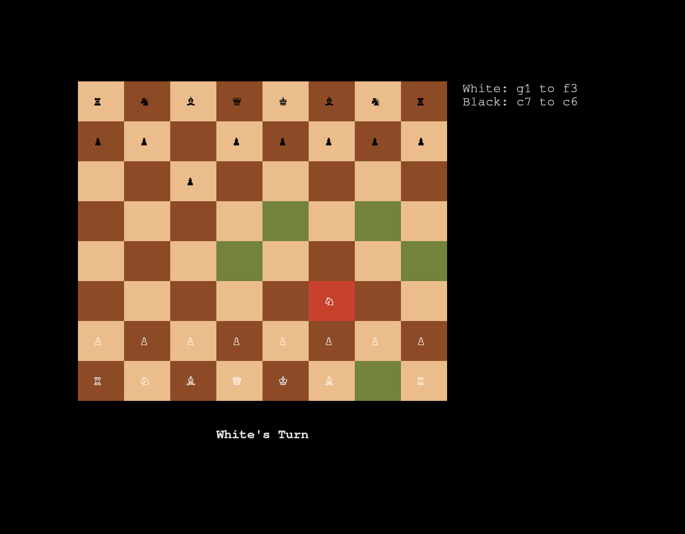
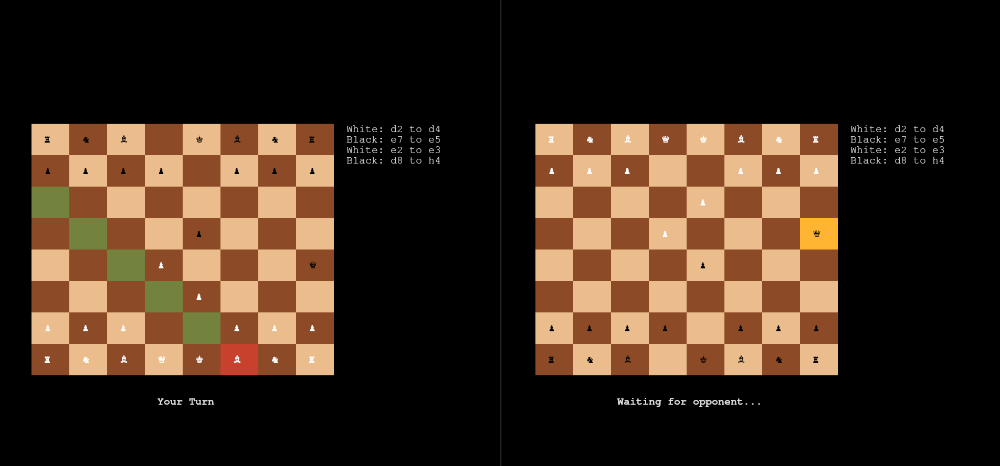

                                 _____ _____ ___  _     _     ____ _____ _____                                             
                                /__ __Y__ __\\  \//     / \__/|/  _ Y__ __Y  __/                                           
                                  / \   / \   \  /_____ | |\/||| / \| / \ |  \                                             
                                  | |   | |   / / \____\| |  ||| |-|| | | |  /_                                            
                                  \_/   \_/  /_/        \_/  \|\_/ \| \_/ \____\                                           

A minimal, terminal-based chess game and multiplayer TCP server written in Rust.

**tty-mate** lets you play chess directly in your terminal. You can play locally or connect to the custom broker server to play against other people over the network. It uses a clean interface built with `ratatui` and focuses entirely on the gameplay.

## Screenshots

|                  Menu                  |                Board                  |
| :--------------------------------------------: | :--------------------------------------: |
|  |  | 

|                 Multiplayer            |
| :--------------------------------------------: |
|  |

## Features

* **Terminal UI:** Split view showing the interactive board and an auto-scrolling move history panel.
* **Full FIDE Rule Enforcement:** The internal state machine correctly handles standard piece movement, Check, Checkmate, Castling, and En Passant.
* **Online Multiplayer:** A custom TCP broker server automatically queues and pairs connecting players into real-time matches.
* **Algebraic Notation:** Automatically records moves in standard chess notation.

## Current Limitations

Since this is an MVP, there are a few hardcoded boundaries and edge cases:

* **Networking:** The server is currently hardcoded to listen on port `8080`, and the client automatically attempts to connect to `127.0.0.1:8080`. Custom IP and port configurations are not yet supported.
* **Pawn Promotion:** Pawns automatically promote to a Queen when reaching the end of the board. A menu to choose the promotion piece is planned.
* **Draw by Repetition:** The game does not yet automatically detect a draw if the exact same board state repeats three times.

## How to Install and Run

Make sure you have [Rust and Cargo](https://rustup.rs/) installed on your system.

1. Clone the repository:
```bash
git clone https://github.com/rlpratyoosh/tty-mate.git
cd tty-mate

```

2. Start the Multiplayer Server (Optional, required for online play):

```bash
cargo run --release --bin tty-mate-server

```

*Note: The server will quietly run in the background listening on port 8080.*

3. Run the Game Client:

```bash
cargo run --release --bin tty-mate-client

```

*Note: Use `j/k/h/l` or arrow keys to navigate the menu and board. Press `Enter` to select/move a piece, and `Esc` to cancel a selection.*

4. Run Benchmark:
```bash
cargo run --release --bin bench -- -c 2000 -m 20 -t 10
```

*Note: `-c` represents concurrent players, `-m` represents consecutive moves per player, `-t` represents waiting time in queue for each player.*


## Contributing

This is a personal portfolio project built for my own learning and growth. As such, **I am not accepting pull requests or external contributions at this time.** However, you are more than welcome to fork the repository, read the code, and experiment with it on your own!
